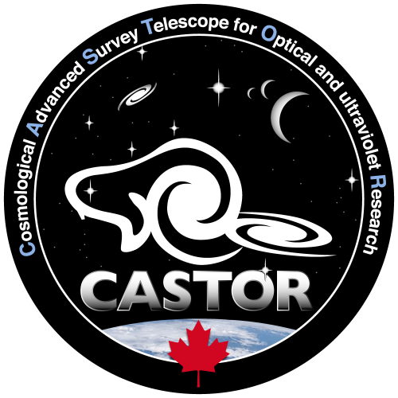

# CASTOR Exposure Time Calculator (ETC)



## Overview

This Python package is an open-source, pixel-based exposure time calculator for
[CASTOR](https://www.castormission.org/), a proposed Canadian space telescope mission 🇨🇦. 

Due to the typically long development cycles of space telescope projects, this tool was developed with a large variety of tunable parameters. `castor_etc` allows users to define your own telescope, sources, amongst other parameters that are not normally exposed in most other exposure time calculators!

To get started, you can visit our [Read the Docs](https://forecastor-etc.readthedocs.io/en/latest/) and view the
[example notebooks](https://github.com/CASTOR-telescope/ETC_notebooks). Please also note the [acknowledgements](#acknowledgements) prior to using `castor_etc` in your work.

## Installation

To get started quickly, run the following command:

```Bash
pip install git+https://github.com/CASTOR-telescope/ETC.git
```

More details on other ways of installation are found in our [installation guide](./docs/INSTALLATION.md).

## Examples

To get started, check out the [basic example on using `castor_etc` for photometry](https://github.com/CASTOR-telescope/ETC_notebooks/blob/master/getting_started_photometry.ipynb).

More examples are available in a [separate repository](https://github.com/CASTOR-telescope/ETC_notebooks)

There is also a work-in-progress, browser-based graphical user interface (GUI) that complements this ETC. This is located in the [ETC_frontend repository](https://github.com/CASTOR-telescope/ETC_frontend).


## Roadmap

Here are some future plans for the ETC:

- Arbitrary source profiles (i.e., surface brightness profiles) based on a FITS file
  _with_ spectrum? Not sure what I would be asking the user for in this case (e.g., what
  unit should the FITS file data be in?)... Please let me know if you have any ideas!
- Support simulating multiple sources within the same aperture (e.g., a point source on
  top of a galaxy).
- Make unit tests and implement continuous integration.


## Questions, Issues, Suggestions, and Other Feedback

For any questions, please feel free to [open a discussion](https://github.com/CASTOR-telescope/ETC/discussions) on GitHub, or contact one of the maintainers (Isaac Cheng, Tyrone Woods, Jade Yeung, or Charles Lee).

To contribute, please briefly read through [our contribution guide](./docs/CONTRIBUTING.md)

## Acknowledgements

> Full bibtex entries for each of these are found [here](./docs/acknowledgement.md)

If you are making reference to the CASTOR Telescope, please cite the [CASTOR summary paper in SPIE JATIS](https://www.spiedigitallibrary.org/journals/Journal-of-Astronomical-Telescopes-Instruments-and-Systems/volume-11/issue-4/042202/The-CASTOR-mission/10.1117/1.JATIS.11.4.042202.full). 

If you use this code in your research, please cite the
[FORECASTOR I.](https://ui.adsabs.harvard.edu/abs/2024AJ....167..178C/abstract)
paper.

Additionally, if you utilize the UVMOS spectrograph features, please cite the [UVMOS SPIE proceeding](https://ui.adsabs.harvard.edu/abs/2022SPIE12181E..77G/abstract):