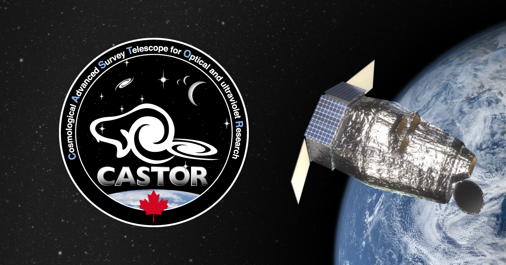

# What is CASTOR

The *Cosmological Advanced Survey Telescope for Optical and ultraviolet Research (CASTOR)* is a proposed mission, led by the National Research Council of Canada and the Canadian Space Agency with a planned launch in late 2020s. The telescope will provide wide-field (0.25 $deg^{2}$) UV and optical imaging at Hubble-like resolution (∼0.15′′). *CASTORs* reference optical design is a 1 metre unobscured three-mirror anastigmat telescope. These mirrors divide the incident flux between three filters corresponding to the NUV, u, and g-bands, together providing simultaneous coverage over the wavelength range ∼150–550 nm.

Within the first five years of *CASTORs* launch, it will image ~5% of the sky reaching a u-band depth 1.3 magnitudes deeper than LSST (Côté et al. 2019a). It will also provide the widest deepest, and highest-resolution legacy survey available in the UV and blue-optical. *CASTORs* reference design contains a digital micro-mirror device (DMD)-based configurable UV multi-object spectrograph (UVMOS) in a parallel field, providing access to 𝜆 ∼ 1500–3000 Å with R ∼ 1500. *CASTOR* also has low-resolution (R∼300–420) grism-mode spectroscopy in the UV- and u-bands over the entire field of view.

With these tools *CASTOR* can accomplish a range of transformative science in virtually
every subfield of astronomy, from the deeper probing of the universe in cosmology and blackholes to the smaller more precise observations of exoplanet atmospheres and mapping of the outer solar system. While this important science is taking place, *CASTOR* will provide an enormous legacy of archival observations strongly complementary to other wide-field surveys over the next decade (e.g., Euclid, Roman). This will happen through a dedicated transient survey and a Target of Opportunity (ToO) program.

